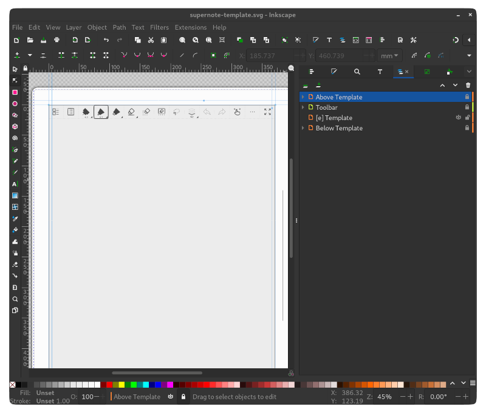

# Supernote Inkscape Template
An Inkscape SVG for creating new Supernote document templates. Features an SVG depiction of the Supernote. Works well with the [Inkscape Export Layers](https://github.com/dmitry-t/inkscape-export-layers) plugin. The page of the SVG corresponds to the screen size of the Supernote, so exporting an individual layer produces a PNG with the correct dimensions for the Supernote. If you use the plugin this means you can keep all your templates in one file with one layer per template. Then go to `Extensions>Export>Export layers...` and all your templates will be exported at once.

Note that the PNGs exported by Inkscape includes transparency which is not needed. Removing it will reduce the file size. You can use ImageMagick to do so with the following command:

```sh
convert input_image_name.png \
	-background white \
	-alpha remove \
	-alpha off \
	output_image_name.png
```



License: [CC BY-SA 4.0](https://creativecommons.org/licenses/by-sa/4.0/).